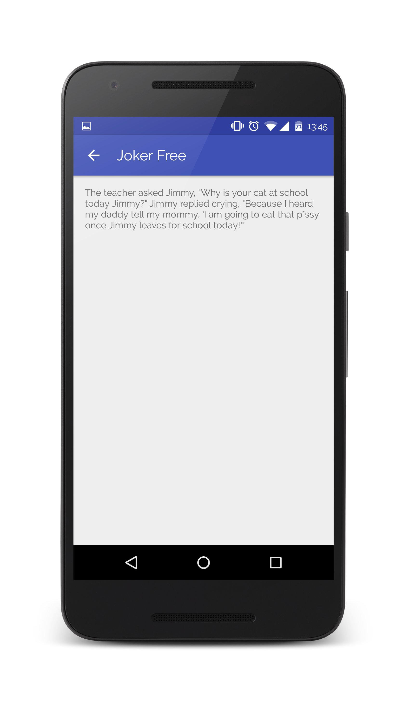

# Joker (Build It Bigger)
An app with multiple flavors that uses multiple libraries and Google Could Endpoints developed by me for the fourth stage (Gradle for Android and Java) of Android Nanodegree Program.

App evaluated and graded as "Exceeds Specifications" by certified Udacity code reviewer.

## Features

The app consists of four modules:
* Java library that provides jokes
* Google Could Endpoints (GCE) project that serves those jokes
* Android Library containing an activity for displaying jokes
* Android app that fetches jokes from the GCE module and passes them to the Android Library for display

## Why this Project?

As Android projects grow in complexity, it becomes necessary to customize the behavior of the Gradle build tool, allowing automation of repetitive tasks. Particularly, factoring functionality into libraries and creating product flavors allow for much bigger projects with minimal added complexity.

## What I Have Learned?

During this project, I:

* Added free and paid flavors to an app, and set up the build to share code between them
* Factored reusable functionality into a Java library
* Factored reusable Android functionality into an Android library
* Configured a multi project build to compile my libraries and app
* Used the Gradle App Engine plugin to deploy a backend
* Configured an integration test suite that runs against the local App Engine development server
* Add Interstitial Ad

## Screenshots

## Android Developer Nanodegree
[![udacity][1]][2]

[1]: screenshots/nanodegree.png
[2]: https://www.udacity.com/course/android-developer-nanodegree--nd801

## License

    Copyright 2015 Orkhan Gasimli

    Licensed under the Apache License, Version 2.0 (the "License");
    you may not use this file except in compliance with the License.
    You may obtain a copy of the License at

        http://www.apache.org/licenses/LICENSE-2.0

    Unless required by applicable law or agreed to in writing, software
    distributed under the License is distributed on an "AS IS" BASIS,
    WITHOUT WARRANTIES OR CONDITIONS OF ANY KIND, either express or implied.
    See the License for the specific language governing permissions and
    limitations under the License.